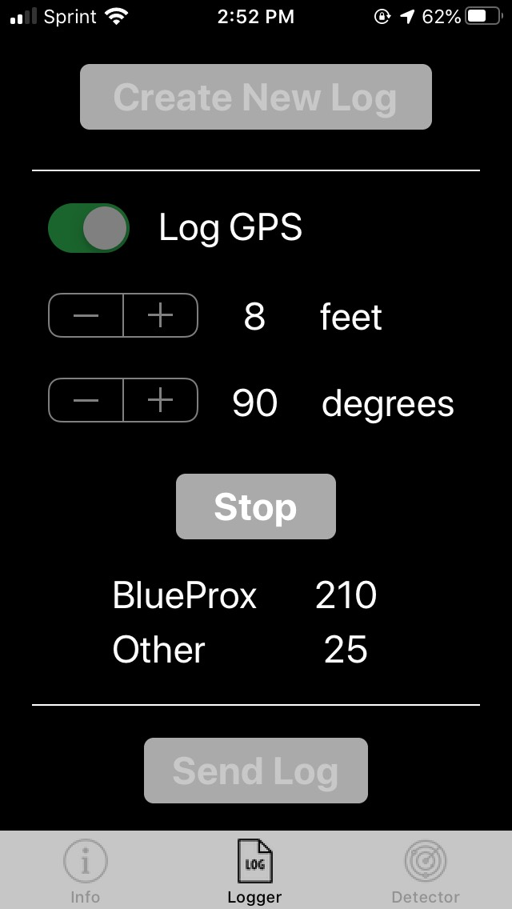
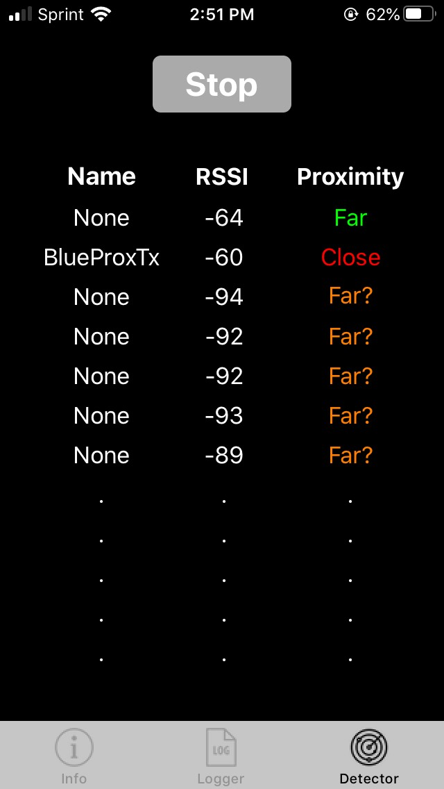

# BluetoothProximity

This is a basic iOS application that was built to log information from the Bluetooth receiver and other sensors on iPhones. The purpose of logging the data is to understand the Bluetooth radio propagation channel between devices in everyday use. By collecting this data, algorithms can be developed that use knowledge of the phone's state, along with the Bluetooth Received Signal Strength Indicator (RSSI), to determine if a Bluetooth device is close or far away.

At a basic level, the RSSI decreases proportionally to the square of the distance between the transmitter and receiver. With knowledge of the transmitter power, the RSSI gives insight into the path loss, and thus the range. However, when a phone is in a pocket or masked by the body, the path loss can be much larger. By using this app to collect data in different scenarios, we hope to design a proximity detector with a high probably of detection and low probability of false alarm.

On first launch, approve the use of Bluetooth and allow location and motion services (logging GPS and other sensors can by optionally configured). If you're having issues recording data, make sure that you've enabled access to location services, Bluetooth, and motion & fitness (under the privacy settings of your phone).

## Installation

Options to install the app include:
- Use Xcode to build from source and deploy
- Ask us for an invite to the TestFlight beta testing program

## Contact

For questions/support: 
- bluetooth-proximity-admin@mit.edu
- Open an issue on GitHub

To submit data and log files:
- bluetooth-proximity-data@mit.edu

## Logger Tab

The logger tab is the main interface for collecting data, and requires using two phones for controlled measurements. The basic process (on both phones) is:

1. Use the settings button at the top to choose which sensors to record (note: this is not shown in the screenshot, which was from an older version)
2. Create a new log using the button
3. Configure a collection:
	- Measure and set the range between the two phones
	- Approximate and set the angle between the two phones (this is from the receiver's prospective, and 0 degrees is facing the transmitter)
	- Hit the run button to start collecting data
	- The counters below the button should start incrementing when both phones are running. BlueProxTx shows an RSSI count for the transmitting device under test, and Other shows the RSSI count for all other Bluetooth devices discovered.
	- Hit the button again to stop collecting data
4. Repeat step 3 as many times as desired, at various ranges and angles
5. Click the send log button at the bottom to open the sharing interface, where you can email the data or share via other means. Make sure to record a description of what the test was (indoor, outdoor, phone in a pocket, ...).
5. Start over from step 1 to carry out another test, for example in a different environment.

See below for a description of the log file format (or take a look at the source code!).



## Detector Tab

The detector tab shows a table of devices, their current RSSI, and if they are predicted to be close or far. Configure the detector parameters (if desired) using the settings button, and start or stop the live view using the run button (note: the settings button is not shown in the screenshot below, since that was from an older version).

While the live view is running, the device will advertise the BlueProxTx name in addition to scanning, so you can use this screen as the "transmit" phone during logging experiments, if desired.

A close/far decision with a ? indicates that there isn't enough data to make a decision yet. Please note that the decisions reported here are mostly for experimentation and debugging. A real-world detector may use more information, such as phone sensor data and timestamps, to determine a more accurate proximity. The detector tab will serve as a playground of sorts to prototype and evaluate new algorithms.



## Ultrasonic Tab

The ultrasonic tab performs a ranging measurement between two phones and displays the result in feet. The ranging protocol is actively under development, so fair warning that the results may not always be accurate!

The basic process for taking measurements is:
1. Choose to be leader or follower. The measurement process requires two phones, where only the leader can initiate a measurement, and the follower simply responds to requests from the leader.
2. Enter the true range.
3. Press run on the leader phone. After a measurement is complete, the range estimate and other metrics will be shown below.

Everytime an ultrasonic waveform is sent or received, the raw data samples and timestamps are saved to file on the phone in a binary format. The file contains the node name (leader or follower), true range, and count. See the source code (UltrasonicViewController) for more details on the file format - they can easily be read into and processed using Python or MATLAB.

Things that can mess up the range measurements:
- Nearby sources of ultrasonic noise
- The two phones don't have direct line of sight to each other
- The phones are in a high multipath environment (e.g., in a corner of a room)
- One or both phones are moving at a non-negligible speed

## Logger Format

Timestamped data is written to the log in a comma separated way. The general format is:

```
Timestamp, sensor name, sensor values
```

Here's a description of the data after a timestamp:

```
Device, unique ID, model, name
AppState, foreground or background
Range, value in feet
Angle, value in degrees
Bluetooth, UUID, RSSI, advertised name, TX power level, advertised timestamp
Accelerometer, x, y, z
Gyroscope, x, y, z
Proximity, enabled or disabled
GPS, latitude, longitude, altitude, speed, course
Activity, 0-5 (stationary/walking/running/cycling/automotive/unknown)
Pedometer, distance, step count, pace, cadence
Altimeter, altitude, pressure
Compass ,magnetic heading, true heading, heading accuracy, x, y, z
```

## Supported Devices

This app has been used on the following iPhone models:
- SE
- 5S
- 6
- 6S
- 7
- 8
- 8 Plus
- 10
- XR
- 11 Pro

There hasn't been extensive testing for all of these devices, nor the various iOS versions that may be in circulation. If something doesn't work as expected on your phone, please send us feedback!

## License

MIT License. Additional licensing information can be found in LICENSE.md.

## Disclaimer

DISTRIBUTION STATEMENT A. Approved for public release. Distribution is unlimited.
 
This material is based upon work supported by the United States Air Force under Air Force Contract No. FA8702-15-D-0001. Any opinions, findings, conclusions or recommendations expressed in this material are those of the author(s) and do not necessarily reflect the views of the United States Air Force.
 
(c) 2020 Massachusetts Institute of Technology.
 
The software/firmware is provided to you on an As-Is basis
 
Delivered to the U.S. Government with Unlimited Rights, as defined in DFARS Part 252.227-7013 or 7014 (Feb 2014). Notwithstanding any copyright notice, U.S. Government rights in this work are defined by DFARS 252.227-7013 or DFARS 252.227-7014 as detailed above. Use of this work other than as specifically authorized by the U.S. Government may violate any copyrights that exist in this work.